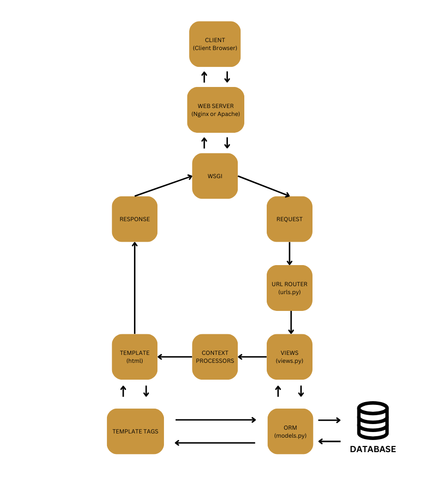
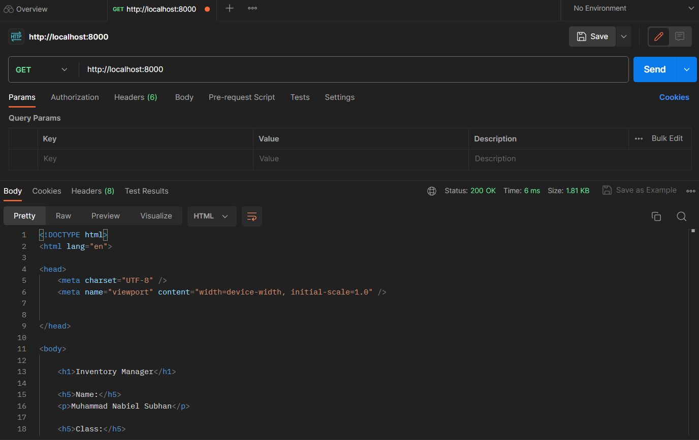
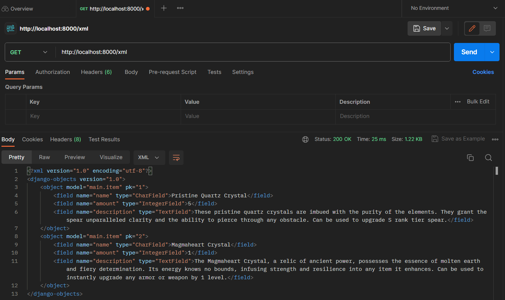
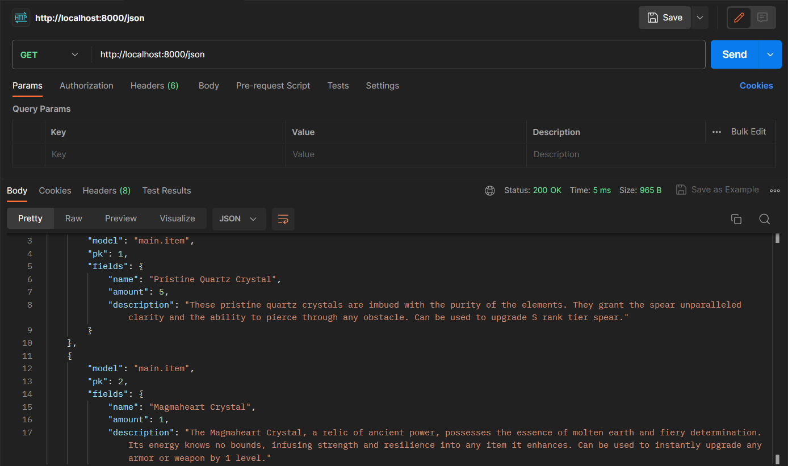
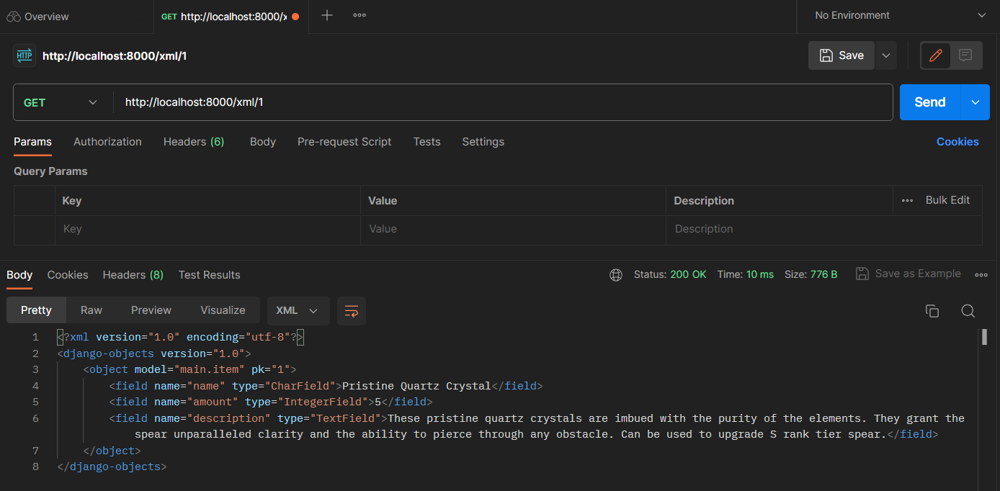
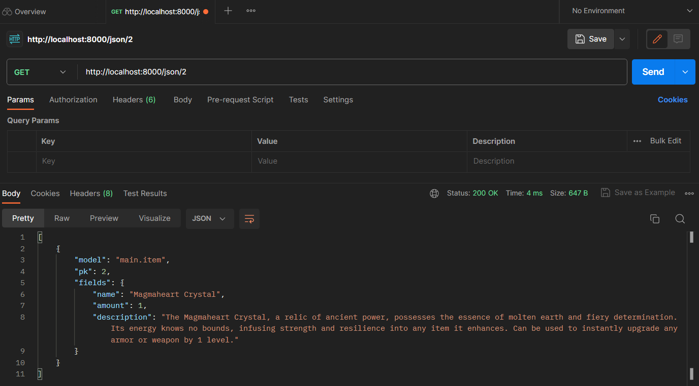
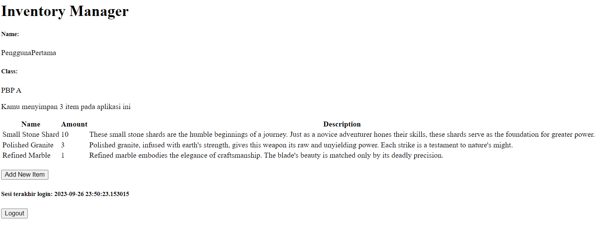
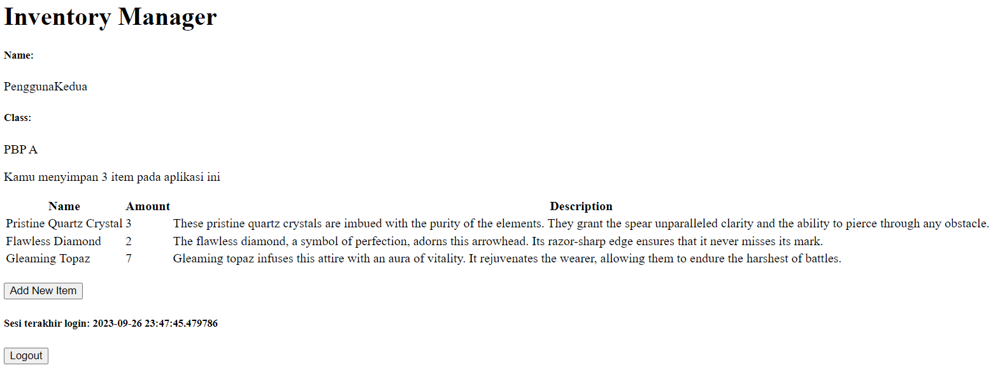

# Inventory Manager
**Tugas 2 PBP**

**Nama    : Muhammad Nabiel Subhan**<br>
**NPM     : 2206081553**<br>
**Kelas   : PBP A**<br>

Tautan untuk menuju aplikasi Inventory Manager -> [Inventory Manager](https://inventory-manager.adaptable.app/main/)

# Tugas 2: Implementasi Model-View-Template (MVT) pada Django
## Membuat Proyek Django Baru
1. Membuat direktori baru dengan nama `Tugas 2`, lalu membuka *command prompt* pada direktori tersebut.
2. Membuat *virtual environment* dengan menjalankan perintah `python -m venv env`.
3. Mengaktifkan *virtual environment* dengan menjalankan perintah `env\Scripts\activate.bat`.
4. Membuat file baru dengan nama `requirements.txt` pada direktori yang sama, lalu memasukkan beberapa *dependencies* yang akan digunakan, yaitu:
```txt
django
gunicorn
whitenoise
psycopg2-binary
requests
urllib3
```
5. Memasang *dependencies* tersebut dengan menjalankan perintah `pip install -r requirements.txt`.
6. Membuat proyek Django baru dengan nama `inventory-manager` menggunakan perintah `django-admin startproject inventory-manager .`.
7. Menambahkan `*` pada `ALLOWED_HOST` pada file `settings.py` untuk mengizinkan akses ke semua host sehingga aplikasi dapat diakses secara luas.
```python
...
ALLOWED_HOSTS = ["*"]
...
```
8. Menjalankan server Django dengan menggunakan perintah `python manage.py runserver` pada *command prompt* dan pergi ke http://localhost:8000 untuk mengecek apakah aplikasi Django telah berhasil dibuat yang ditandai dengan adanya animasi roket.
9. Menonaktifkan *virtual environment* setelah aplikasi Django berhasil dibuat dengan menjalankan perintah `deactivate`.
10. Menambahkan file `.gitignore` dan mengisinya dengan teks berikut untuk menentukan file dan direktori mana saja yang perlu diabaikan oleh Git.
```txt
# Django
*.log
*.pot
*.pyc
__pycache__
db.sqlite3
media

# Backup files
*.bak 

# If you are using PyCharm
# User-specific stuff
.idea/**/workspace.xml
.idea/**/tasks.xml
.idea/**/usage.statistics.xml
.idea/**/dictionaries
.idea/**/shelf

# AWS User-specific
.idea/**/aws.xml

# Generated files
.idea/**/contentModel.xml

# Sensitive or high-churn files
.idea/**/dataSources/
.idea/**/dataSources.ids
.idea/**/dataSources.local.xml
.idea/**/sqlDataSources.xml
.idea/**/dynamic.xml
.idea/**/uiDesigner.xml
.idea/**/dbnavigator.xml

# Gradle
.idea/**/gradle.xml
.idea/**/libraries

# File-based project format
*.iws

# IntelliJ
out/

# JIRA plugin
atlassian-ide-plugin.xml

# Python
*.py[cod] 
*$py.class 

# Distribution / packaging 
.Python build/ 
develop-eggs/ 
dist/ 
downloads/ 
eggs/ 
.eggs/ 
lib/ 
lib64/ 
parts/ 
sdist/ 
var/ 
wheels/ 
*.egg-info/ 
.installed.cfg 
*.egg 
*.manifest 
*.spec 

# Installer logs 
pip-log.txt 
pip-delete-this-directory.txt 

# Unit test / coverage reports 
htmlcov/ 
.tox/ 
.coverage 
.coverage.* 
.cache 
.pytest_cache/ 
nosetests.xml 
coverage.xml 
*.cover 
.hypothesis/ 

# Jupyter Notebook 
.ipynb_checkpoints 

# pyenv 
.python-version 

# celery 
celerybeat-schedule.* 

# SageMath parsed files 
*.sage.py 

# Environments 
.env 
.venv 
env/ 
venv/ 
ENV/ 
env.bak/ 
venv.bak/ 

# mkdocs documentation 
/site 

# mypy 
.mypy_cache/ 

# Sublime Text
*.tmlanguage.cache 
*.tmPreferences.cache 
*.stTheme.cache 
*.sublime-workspace 
*.sublime-project 

# sftp configuration file 
sftp-config.json 

# Package control specific files Package 
Control.last-run 
Control.ca-list 
Control.ca-bundle 
Control.system-ca-bundle 
GitHub.sublime-settings 

# Visual Studio Code
.vscode/* 
!.vscode/settings.json 
!.vscode/tasks.json 
!.vscode/launch.json 
!.vscode/extensions.json 
.history
```

## Membuat aplikasi dengan nama `main` pada proyek `inventory-manager`
1. Mengaktifkan kembali *virtual environment* dengan menjalankan perintah `env\Scripts\activate.bat`.
2. Menjalankan perintah `python manage.py startapp main` untuk membuat aplikasi baru dengan nama `main`.
3. Mendaftarkan aplikasi `main` dengan cara pergi ke file `settings.py`, lalu menambahkan `'main'` ke dalam variabel `INSTALLED_APPS`.
```python
INSTALLED_APPS = [
    ...,
    'main',
    ...
]
```

## Membuat model pada aplikasi `main`
1. Mengubah isi file `models.py` yang terdapat pada direktori aplikasi `main` untuk membuat model baru dengan nama `Item` yang memiliki atribut:
* `name` sebagai nama item dengan tipe `CharField`.
* `amount` sebagai jumlah item dengan tipe `IntegerField`.
* `description` sebagai deskripsi item dengan tipe `TextField`.
2. Mengisi file `models.py` dengan kode berikut.
```python
from django.db import models

class Item(models.Model):
    name = models.CharField(max_length=255)
    amount = models.IntegerField()
    description = models.TextField()
```
3. Menjalankan perintah `python manage.py makemigrations` untuk membuat file migrasi yang berisi perubahan model basis data, lalu jalankan perintah `python manage.py migrate` untuk memigrasikannya ke dalam basis data lokal. Lakukan langkah ini setiap kali ada perubahan pada model.
 
## Membuat sebuah fungsi pada `views.py` untuk dikembalikan ke dalam sebuah template  yang menampilkan nama aplikasi, nama, dan kelas
1. Membuat direktori baru dengan nama `templates`, lalu membuat file `main.html` di dalam direktori tersebut.
2. Mengisi file `main.html` dengan kode berikut.
```
<h1>{{ appname }}</h1>

<h5>Name: </h5>
<p>{{ name }}</p> <!-- Ubahlah sesuai dengan nama kamu -->
<h5>Class: </h5>
<p>{{ class }}</p> <!-- Ubahlah sesuai dengan kelas kamu -->
```
3. Setelah itu, membuka file `views.py` di dalam file aplikasi main, lalu menambahkan baris impor `from django.shortcuts import render` untuk mengimpor fungsi render dari modul `django.shortcuts` yang nantinya berfungsi untuk me-render file HTML yang sudah dibuat.
4. Menambahkan fungsi `show_main` di dalam file `views.py` dengan kode berikut.
```python
def show_main(request):
    context = {
        'appname': 'Inventory Manager',
        'name': 'Muhammad Nabiel Subhan',
        'class': 'PBP A'
    }

    return render(request, "main.html", context)
```
Nilai dari variabel yang didefinisikan pada `context` akan muncul pada file HTML dengan menggunakan sintaks `{{ appname }}`, `{{ name }}`, dan `{{ class }}`.

## Mengonfigurasi *routing* URL
1. Membuat file baru dengan nama `urls.py` di dalam direktori `main` dan mengisinya dengan kode berikut agar aplikasi `main` dapat diakses melalui peramban web.
```python
from django.urls import path
from main.views import show_main

app_name = 'main'

urlpatterns = [
    path('', show_main, name='show_main'),
]
```
2. Membuka file `urls.py` yang ada di dalam direktori proyek `inventory_manager`, lalu menambahkan baris impor berikut.
```python
...
from django.urls import path, include
...
```
Lalu, tambahkan rute URL `main` ke dalam variabel `urlpatterns` dengan kode berikut.
```python
urlpatterns = [
    ...
    path('main/', include('main.urls')),
    ...
]
```
Dengan begitu, rute URL proyek telah terhubung ke tampilan `main`.

## Melakukan *deployment* ke Adaptable terhadap aplikasi yang sudah dibuat
1. Membuka [GitHub](https://github.com/), lalu buat repositori baru dengan nama `inventory-manager`. Mengatur visibilitas proyek sebagai "Public" dan membiarkan pengaturan lainnya sesuai *default*.
2. Buka command prompt di direktori `Tugas 2`, lalu membuat *branch* utama baru dengan menjalankan perintah `git branch -M master`, lalu menghubungkannya dengan repositori yang barusan dibuat di github dengan menjalankan perintah `git remote add origin https://github.com/nabielsubhan/inventory-manager.git`.
3. Melakukan *push* ke repositori GitHub dengan menjalankan perintah `git add .`, lalu `git commit -m "Proyek Inventory Manager Tugas 2 PBP"`, dan `git push -u origin master`.
4. Setelah itu, *login* ke [Adaptable.io](https://adaptable.io/).
5. Tekan tombol `New App`, lalu pilih `Connect an Existing Repository`.
6. Hubungkan [Adaptable.io](https://adaptable.io/) dengan GitHub dan pilih `All Repositories` pada proses instalasi.
7. Pilih repositori `inventory-manager` sebagai basis aplikasi yang akan di-*deploy* dan *branch* yang akan digunakan.
8. Pilih `Python App Template` sebagai template *deployment*.
9. Pilih `PostgreSQL` sebagai tipe basis data yang akan digunakan.
10. Mengganti versi python menjadi `3.11`.
11. Pada bagian `Start Command`, isi dengan `python manage.py migrate && gunicorn inventory_manager.wsgi`.
12. Masukkan `inventory-manager` sebagai nama aplikasi.
13. Centang bagian `HTTP Listener on PORT` dan klik `Deploy App` untuk memulai proses *deployment*.

## **BONUS: Membuat unit test**
Saya menambahkan tes untuk mengecek apakah model berhasil dibuat dan apakah data yang dibuat telah sesuai dengan menambahkan kode berikut ke file `tests.py`.
```python
from django.test import TestCase, Client
from main.models import Item

# Create your tests here.
class mainTest(TestCase):
    def test_main_url_is_exist(self):
        response = Client().get('/main/')
        self.assertEqual(response.status_code, 200)

    def test_main_using_main_template(self):
        response = Client().get('/main/')
        self.assertTemplateUsed(response, 'main.')

    def test_create_template(self):
        item = Item.objects.create(
            name="an item",
            amount="10",
            description="the total of this item is 10"
        )

        self.assertEqual(item.name, "an item")
        self.assertEqual(item.amount, "10")
        self.assertEqual(item.description, "the total of this item is 10")
```
Setelah menjalankan perintah `python manage.py test` pada *command prompt*, inilah hasil tes yang keluar.
```txt
Found 3 test(s).
Creating test database for alias 'default'...
System check identified no issues (0 silenced).
...
----------------------------------------------------------------------
Ran 3 tests in 0.012s

OK
Destroying test database for alias 'default'...
```

## Bagan *Request Client* pada Web Aplikasi Berbasis Django
<br>
Alur cara kerja Django dalam menerima *request* dari *client* adalah sebagai berikut:
1. **Permintaan dari *client***, biasanya melalui peramban web.
2. **Web Server**, permintaan *client* diterima oleh web server (Nginx atau Apache).
3. **WSGI (Web Server Gateway Interface)**, web server meneruskan *request* ke WSGI server yang bertindak sebagai perantara antara web server dengan aplikasi Django.
4. **Request**, *request client* dikirimkan ke aplikasi Django sebagai permintaan HTTP.
5. **URL Router**, mengarahkan *request* ke View yang sesuai dengan URL yang diterima.
6. **Views**, setelah menerima URL, Django memanggil fungsi pada `views.py` yang sesuai dengan permintaan.
7. **ORM (Object-Relational Mapping) dan Database**, View mengakses dan mengolah data dalam *database* sesuai dengan permintaan melalui ORM.
8. **Template Tags**, setelah selesai memproses data, View mengisi template dengan data yang akan ditampilkan (*template tags*).
9. **Context Processors**, *Context Processors* dapat digunakan untuk memberikan data tambahan yang akan ditampilkan.
10. **Template (HTML)**, setelah Template selesai diisi dengan data yang ingin ditampilkan, tampilan HTML akan siap ditampilkan ke pengguna.
11. **Response**, Django menghasilkan konten HTML dan informasi lain sebagai bentuk respons HTTP.
12. **WSGI**, respons HTTP dikirimkan kembali ke WSGI server.
13. **Web Server**, web server menerima respons HTTP dari WSGI server.
14. **Client**, *client* menerima respons dan halaman web yang sesuai dengan permintaan awal akan ditampilkan.

Hubungan antara `urls.py`, `views.py`, `models.py`, dan `html` adalah `urls.py` akan mengarahkan *request* yang diterima ke `View`, lalu `views.py` akan memanggil *function* yang sesuai dengan *request* tersebut. Nantinya `views.py` akan berinteraksi dengan `models.py` untuk memproses, mengubah, atau mengolah data di *database*. Setelah data diproses, file `html` akan diisi dengan template yang menggunakan sintaks dari Django yang memungkinkan untuk memasukkan data yang telah diperoleh dari View ke tampilan pengguna nantinya.

## Mengapa kita menggunakan *Virtual Environment*
Penggunaan *virtual environment* memberikan berbagai manfaat penting, diantaranya adalah terciptanya *environment* yang terpisah untuk setiap proyek yang kita miliki sehingga memungkinkan kita untuk menggunakan versi python, Django, maupun dependensi-dependensi yang berbeda untuk proyek yang berbeda tanpa perlu khawatir akan terjadi konflik. Selain itu, dengan menggunakan *virtual environment* akan membuat lingkungan kerja proyek menjadi lebih bersih dan terorganisir sehingga memudahkan kita untuk mengelola proyek-proyek yang berbeda. *Virtual environment* juga dapat memudahkan ketika melakukan pengerjaan suatu proyek dengan sebuah tim karena setiap anggota dapat memiliki lingkungan virtual masing-masing dengan dependensi yang mereka butuhkan.

## Apakah kita tetap dapat membuat aplikasi web berbasis Django tanpa menggunakan *virtual environment*?
Kita tetap dapat membuat aplikasi web berbasis Django tanpa menggunakan *virtual environment*, tetapi akan terdapat beberapa masalah yang akan timbul, seperti konflik antara *dependencies* dan sulitnya mengelola versi python yang digunakan pada proyek berbeda. Bahkan, ketika kita mencoba untuk menghapus suatu *package* pada proyek tertentu, hal tersebut dapat berpotensi untuk merusak proyek-proyek lain yang menggunakan *package* tersebut. Oleh karena itu, penggunaan *virtual environment* sangat dianjurkan ketika membuat proyek aplikasi web berbasis Django.

## Apa itu MVC, MVT, dan MVVM
MVC (Model-View-Controller), MVT (Model-View-Template), dan MVVM (Model-View-ViewModel) adalah suatu pola arsitektur perangkat lunak yang digunakan untuk merancang struktur dan organisasi umum suatu perangkat lunak. Pola arsitektur tersebut membagi perangkat lunak menjadi beberapa bagian sehingga pengembangan aplikasi dapat lebih terstruktur dan mudah untuk dikelola. Ketiga pola arsitektur tersebut mempunyai keunikan tersendiri dalam mengelola suatu proyek aplikasi.

* **MVC (Model-View-Controller)**
MVC membagi aplikasi menjadi 3 komponen, yaitu Model, View, dan Controller. Model berfungsi untuk memproses, menyimpan, dan mengelola data serta mengatur aturan bisnis aplikasi, View berfungsi untuk menampilkan data dari Model kepada pengguna, dan Controller berfungsi untuk mengelola aliran aplikasi dan menjaga ke-sinkronan antara Model dan View.
* **MVT (Model-View-Template)**
MVT memisahkan komponen-komponen pada aplikasi menjadi 3 bagian juga, yaitu Model, View, dan Template. Tugas Model pada MVT kurang lebih sama dengan Model pada MVC, yaitu untuk mengatur dan mengelola data aplikasi, View pada MVT berfungsi untuk mengelola logika presentasi data aplikasi kepada pengguna, sedangkan Template adalah komponen yang berfungsi untuk mengatur antarmuka yang akan ditampilkan kepada pengguna.
* **MVVM (Model-View-ViewModel)**
MVVM membagi aplikasi menjadi 3 komponen juga, yaitu Model, View, dan ViewModel. Model berfungsi untuk mengatur data dan logika bisnis aplikasi, View mengelola antarmuka untuk menampilkan data pada pengguna, sedangkan ViewModel berfungsi untuk Menghubungkan Model dan View serta menjalankan operasi untuk mengubah data pada Model yang nantinya akan ditampilkan oleh View.

MVC dan MVT biasanya digunakan untuk melakukan pengembangan web, sedangkan MVVM lebih umum digunakan untuk mengembangkan aplikasi yang berfokus pada tampilan antarmuka pengguna. Bahasa pemrograman yang biasa digunakan pada MVC adalah Ruby atau Python, pada MVT bahasa yang digunakan adalah Python, sedangkan untuk MVVM bahasa yang sering digunakan adalah C# atau Javascript. Meskipun begitu, bahasa yang digunakan ketika akan mengembangkan suatu aplikasi bergantung pada preferensi pengembang serta ekosistem yang akan digunakan.

# Tugas 3: Implementasi Form dan Data Delivery pada Django
##  Membuat input form untuk menambahkan objek model
1. Mengubah routing main/ menjadi / agar lebih sesuai dengan konvensi pada `urls.py` di folder `inventory_manager`.
```python
urlpatterns = [
    path('', include('main.urls')),
    path('admin/', admin.site.urls),
]
```
2. Membuat kerangka dasar untuk halaman web lainnya dengan membuat folder `templates` pada *root folder* dan membuat file dengan nama `base.html`. Setelah itu, isi file tersebut dengan kode berikut.
```html

<!DOCTYPE html>
<html lang="en">
    <head>
        <meta charset="UTF-8" />
        <meta
            name="viewport"
            content="width=device-width, initial-scale=1.0"
        />
        
        
    </head>

    <body>
        
        
    </body>
</html>
```
3. Modifikasi file `settings.py` yang ada pada direktori `inventory_manager` dengan menambahkan kode berikut pada bagian `TEMPLATES`.
```python
'DIRS': [BASE_DIR / 'templates'],
```
4. Ubah file `main.html` pada subdirektori `templates` yang ada pada direktori `main` dengan menambahkan baris kode berikut di awal.
```html

```
5. Membuat file baru dengan nama `forms.py` untuk membuat form yang dapat menerima data produk baru. Tambahkan kode berikut ke dalam file tersebut.
```python
from django.forms import ModelForm
from main.models import Item

class ItemForm(ModelForm):
    class Meta:
        model = Item
        fields = ["name", "amount", "description"]
```
6. Buka `views.py`, lalu tambahkan *import* berikut.
```python
from django.http import HttpResponseRedirect
from main.forms import ProductForm
from django.urls import reverse
```
7. Buat fungsi `create_item` pada file `views.py` untuk membuat formulir yang dapat menambahkan data item baru ketika form di-*submit*.
```python
def create_item(request):
    form = ItemForm(request.POST or None)

    if form.is_valid() and request.method == "POST":
        form.save()
        return HttpResponseRedirect(reverse('main:show_main'))

    context = {'form': form}
    return render(request, "create_item.html", context)
```
8. Ubah fungsi `show_main` pada file `views.py` menjadi seperti berikut.
```python
def show_main(request):
    items = Item.objects.all()

    context = {
        'appname': 'Inventory Manager',
        'name': 'Muhammad Nabiel Subhan',
        'class': 'PBP A',
        'items': items
    }

    return render(request, "main.html", context)
```
9. *Import* fungsi `create_item` yang sudah dibuat sebelumnya ke file `urls.py` pada direktori `main` dengan menambahkan kode `from main.views import show_main, create_item`, lalu tambahkan *url path*-nya ke `urlpatterns` dengan menambahkan kode `path('create-item', create_item, name='create_item'),`.
10. Buat file dengan nama `create_item.html` pada direktori `main/templates` dan isi file tersebut dengan kode berikut.
```html
 


<h1>Add New Product</h1>

<form method="POST">
    
    <table>
        {{ form.as_table }}
        <tr>
            <td></td>
            <td>
                <input type="submit" value="Add Item"/>
            </td>
        </tr>
    </table>
</form>


```
11. Tambahkan kode berikut pada file `main.html` di dalam `` untuk menampilkan data item dalam bentuk tabel dan menambahkan tombol `Add New Item` yang akan me-*redirect* ke file `create_item.html`.
```html
<table>
        <tr>
            <th>Name</th>
            <th>Amount</th>
            <th>Description</th>
            <th>Date Added</th>
        </tr>

         Berikut cara memperlihatkan data item di bawah baris ini 

        
            <tr>
                <td>{{item.name}}</td>
                <td>{{item.amount}}</td>
                <td>{{item.description}}</td>
                <td>{{item.date_added}}</td>
            </tr>
        
    </table>

    <br />

    <a href="">
        <button>
            Add New Item
        </button>
    </a>
```

## Menambahkan 5 fungsi baru pada `views.py` untuk menampilkan objek yang ditambahkan dalam bentuk HTML, XML, JSON, XML by ID, dan JSON by ID
1. Fungsi untuk menampilkan objek dalam bentuk HTML
* Fungsi `show_main` yang sudah pernah dibuat sebelumnya akan me-*render* file `main.html` yang berisi data item-item yang telah dimasukkan.
```python
def show_main(request):
    items = Item.objects.all()

    context = {
        'appname': 'Inventory Manager',
        'name': 'Muhammad Nabiel Subhan',
        'class': 'PBP A',
        'items': items
    }

    return render(request, "main.html", context)
```
2. Fungsi untuk menampilkan objek yang ditambahkan dalam bentuk XML
* Tambahkan kode *import* berikut pada file `views.py` yang ada pada direktori `main`.
```python
from django.http import HttpResponse
from django.core import serializers
```
* Buat fungsi `show_xml` yang menerima parameter berupa `request` dan memiliki *return statement* yang akan mengembalikan `HttpResponse` yang berisi data *query* yang sudah diserialisasi menjadi XML.
```python
def show_xml(request):
    data = Item.objects.all()
    return HttpResponse(serializers.serialize("xml", data), content_type="application/xml")
```
3. Fungsi untuk menampilkan objek yang ditambahkan dalam bentuk JSON
* Buat fungsi `show_json` yang menerima parameter berupa `request` dan memiliki *return statement* yang akan mengembalikan `HttpResponse` yang berisi data *query* yang sudah diserialisasi menjadi JSON.
```python
def show_json(request):
    data = Item.objects.all()
    return HttpResponse(serializers.serialize("json", data), content_type="application/json")
```
4. Fungsi untuk mengembalikan data berdasarkan ID dalam bentuk XML
* Buat fungsi `show_xml_by_id` yang menerima parameter berupa `request` dan ID yang memiliki *return statement* yang akan mengembalikan `HttpResponse` yang berisi data *query* yang sudah diserialisasi menjadi XML.
```python
def show_xml_by_id(request, id):
    data = Item.objects.filter(pk=id)
    return HttpResponse(serializers.serialize("xml", data), content_type="application/xml")
```
5. Fungsi untuk mengembalikan data berdasarkan ID dalam bentuk JSON
* Buat fungsi `show_json_by_id` yang menerima parameter berupa `request` dan ID yang memiliki *return statement* yang akan mengembalikan `HttpResponse` yang berisi data *query* yang sudah diserialisasi menjadi JSON.
```python
def show_json_by_id(request, id):
    data = Item.objects.filter(pk=id)
    return HttpResponse(serializers.serialize("json", data), content_type="application/json")
```
6. Setelah itu, *import* semua fungsi yang sudah dibuat di atas ke dalam file `urls.py` yang ada pada direktori `main`.
```python
from main.views import show_main, create_item, show_xml, show_json, show_xml_by_id, show_json_by_id
```
7. Tambahkan *path url* ke dalam `urlpatters` agar bisa mengakses fungsi-fungsi yang sudah dibuat.
```python
urlpatterns = [
    path('', show_main, name='show_main'),
    path('create-item', create_item, name='create_item'),
    path('xml/', show_xml, name='show_xml'),
    path('json/', show_json, name='show_json'),
    path('xml/<int:id>/', show_xml_by_id, name='show_xml_by_id'),
    path('json/<int:id>/', show_json_by_id, name='show_json_by_id')
]
```

## Perbedaan antara *form* `POST` dan `GET` pada Django
Perbedaan antara `POST` dan `GET` dapat dilihat pada cara pengiriman datanya. Method `POST` akan mengirimkan data yang ditulis pada form tanpa mencantumkan data tersebut ke url sehingga data yang dikirim tidak akan terlihat oleh siapapun. Biasanya method `POST` digunakan untuk mengirimkan data sensitif, seperti *password*. Di sisi lain, method `GET` akan mengirimkan data yang ditulis pada form dan mencantumkan data tersebut sebagai parameter pada url. Selain itu, perbedaan antara `POST` dan `GET` pada Django adalah tujuan penggunaannya, `POST` biasanya digunakan untuk mengirimkan data yang nantinya akan diolah di server atau melakukan perubahan data pada server, sedangkan `GET` digunakan untuk melakukan permintaan yang bersifat membaca saja.

## Perbedaan XML, JSON, dan HTML dalam konteks pengiriman data
* XML atau *eXtensible Markup Language* dirancang untuk menyimpan dan mengirimkan data. Data pada XML akan direpresentasikan seperti bentuk struktur *tree*. Cara menulisnya adalah dengan menyisipkan data yang ingin disusun pada sepasang *tag* pembuka dan *tag* penutup. Hal tersebut membuat XML memiliki aturan sintaksis yang cukup ketat dan lebih kaku. Selain itu, XML membutuhkan parser khusus untuk memproses data sehingga memakan waktu yang lama untuk mengurai data tersebut.
* JSON atau *JavaScript Object Notation* adalah format untuk menynusun data yang lebih ringan dan mudah dimengerti dibandingkan dengan XML. Data pada JSON disusun dalam bentuk text sehingga memudahkan kita untuk membaca dan memahami data tersebut. Cara menyusun data pada JSON adalah dengan menggunakan pasangan *key* dan *value*. Selain itu, JSON lebih mudah diproses oleh mesin maupun manusia dibandingkan dengan XML.
* HTML atau *HyperText Markup Language* biasanya dirancang untuk menampilkan data dalam bentuk halaman web yang nantinya akan di-*render* oleh web browser sehingga data yang ingin dibaca dapat ditampilkan kepada pengguna. HTML bukanlah format untuk menyimpan maupun melakukan pertukaran data seperti XML atau JSON.

## Mengapa JSON sering digunakan dalam pertukaran data antara aplikasi web modern?
JSON memiliki banyak keunggulan, seperti menggunakan syntax yang mudah dimengerti, lebih mudah diurai datanya dibandingkan XML, memiliki ukuran file yang lebih kecil, dan transmisi data yang lebih cepat.

## Mengakses kelima URL di poin 2 menggunakan Postman
* HTML (http://localhost:8000)
 
* XML (http://localhost:8000/xml)
 
* JSON (http://localhost:8000/json)
 
* XML by ID (http://localhost:8000/xml/1)
 
* JSON by ID (http://localhost:8000/json/2)
 

## Bonus
Menambahkan fitur untuk memberikan pesan banyaknya item yang sudah disimpan pada plikasi dengan menambahkan kode berikut.
```html
<div>
    <p>Kamu menyimpan {{ items|length }} item pada aplikasi ini</p>
</div>
```

# Tugas 4: Implementasi Autentikasi, Session, dan Cookies pada Django
## Mengimplementasikan fungsi registrasi, login, dan logout untuk memungkinkan pengguna untuk mengakses aplikasi sebelumnya dengan lancar.

1. Membuat Fungsi dan Form Registrasi
   * Menyalakan *virtual environment* terlebih dahulu dengan menggunakan perintah `env\Sccripts\activate.bat` pada direktori `Tugas 2`.
   * Membuka file `views.py` pada direktori `main` dan tambahkan beberapa *import* berikut.
     ```python
     from django.shortcuts import redirect
     from django.contrib.auth.forms import UserCreationForm
     from django.contrib import messages  
     ```
   * Membuat fungsi `register` untuk membuat formulir registrasi untuk membuat akun user ketika ingin mengakses aplikasi.
     ```python
     def register(request):
        form = UserCreationForm()

        if request.method == "POST":
            form = UserCreationForm(request.POST)
        if form.is_valid():
            form.save()
            messages.success(request, 'Your account has been successfully created!')
            return redirect('main:login')
        context = {'form':form}
        return render(request, 'register.html', context)
     ```
   * Membuat file `register.html` pada direktori `main/templates` untuk membuat *template* halaman ketika melakukan *register* akun.
     ```html
     

     
        <title>Register</title>
     
    
       
    
     <div class = "login">
        
        <h1>Register</h1>  
    
            <form method="POST" >  
                  
                <table>  
                    {{ form.as_table }}  
                    <tr>  
                        <td></td>
                        <td><input type="submit" name="submit" value="Daftar"/></td>  
                    </tr>  
                </table>  
            </form>
    
          
            <ul>   
                  
                    <li>{{ message }}</li>  
                      
            </ul>   
        
    
     </div>  
    
     
     ```
   * *Import* fungsi `register` ke dalam `urls.py` dan tambahkan *path*-nya ke `urlpatterns`
     ```python
     from main.views import register
     ```
     ```python
     ...
     path('register/', register, name='register'), 
     ...
     ```
2. Membuat Fungsi Login
   * Membuka file `views.py` pada direktori `main` dan tambahkan *import* berikut.
     ```python
     from django.contrib.auth import authenticate, login 
     ```
   * Tambahkan fungsi `login_user` untuk mengautentikasi user yang ingin masuk aplikasi.
     ```python
     def login_user(request):
     if request.method == 'POST':
        username = request.POST.get('username')
        password = request.POST.get('password')
        user = authenticate(request, username=username, password=password)
        if user is not None:
            login(request, user)
            return redirect('main:show_main')
        else:
            messages.info(request, 'Sorry, incorrect username or password. Please try again.')
     context = {}
     return render(request, 'login.html', context)
     ```
   * Membuat file `login.html` pada direktori `main/templates` untuk membuat *template* halaman ketika melakukan *login* akun.
     ```html
     

     
     <title>Login</title>
     

     

     <div class = "login">

     <h1>Login</h1>

     <form method="POST" action="">
        
        <table>
            <tr>
                <td>Username: </td>
                <td><input type="text" name="username" placeholder="Username" class="form-control"></td>
            </tr>
                    
            <tr>
                <td>Password: </td>
                <td><input type="password" name="password" placeholder="Password" class="form-control"></td>
            </tr>

            <tr>
                <td></td>
                <td><input class="btn login_btn" type="submit" value="Login"></td>
            </tr>
        </table>
     </form>

     
        <ul>
            
                <li>{{ message }}</li>
            
        </ul>
          
        
     Don't have an account yet? <a href="">Register Now</a>

     </div>

     
     ```
   * *Import* fungsi `login_user` ke dalam `urls.py` dan tambahkan *path*-nya ke `urlpatterns`
     ```python
     from main.views import register, login
     ```
     ```python
     ...
     path('login/', login_user, name='login'),
     ...
     ```
3. Membuat Fungsi Logout
   *  Membuka file `views.py` pada direktori `main` dan tambahkan *import* berikut.
     ```python
     from django.contrib.auth import authenticate, login, logout
     ```
   * Tambahkan fungsi `logout_user` untuk melakukan mekanisme *logout*.
     ```python
     def logout_user(request):
         logout(request)
         return redirect('main:login')
     ```
   * Tambahkan *button logout* pada file `main.html` setelah *hyperlink tag* untuk *Add New Item*
     ```html
     ...
     <a href="">
     <button>
        Logout
     </button>
     </a>
     ...
     ```
   * *Import* fungsi `logout_user` ke dalam `urls.py` dan tambahkan *path*-nya ke `urlpatterns`
     ```python
     from main.views import register, login_user, logout_user
     ```
     ```python
     ...
     path('logout/', logout_user, name='logout'),
     ...
     ```
4. Tambahkan Restriksi Akses Halaman Main
   * Membuka file `views.py` pada direktori `main` dan tambahkan *import* berikut.
     ```python
     from django.contrib.auth.decorators import login_required
     ```
   * Tambahkan kode berikut di atas fungsi `show_main` untuk merestriksi halaman *main* agar hanya dapat diakses oleh pengguna yang sudah *login*.
     ```python
     ...
     @login_required(login_url='/login')
     def show_main(request):
     ...
     ```

## Membuat dua akun pengguna dengan masing-masing 3 *dummy data*
* Username = PenggunaPertama
  
* Username = PenggunaKedua
  

## Menghubungkan model `Item` dengan `User`.
1. Buka `models.py` pada direktori `main` dan tambahkan *import* berikut.
   ```python
   from django.contrib.auth.models import User
   ```
2. Tambahkan potongan kode berikut pada bagian class Item.
   ```python
   class Item(models.Model):
       user = models.ForeignKey(User, on_delete=models.CASCADE)
   ...
   ```
3. Buka `views.py` dan ubah potongan kode pada bagian fungsi `create_item` menjadi sebagai berikut.
   ```python
   def create_product(request):
       form = ProductForm(request.POST or None)

       if form.is_valid() and request.method == "POST":
           product = form.save(commit=False)
           product.user = request.user
           product.save()
           return HttpResponseRedirect(reverse('main:show_main'))
       ...
   ```
4. Ubah fungsi `show_main` menjadi sebagai berikut.
   ```python
   def show_main(request):
       products = Product.objects.filter(user=request.user)

       context = {
           'name': request.user.username,
        ...
    ...
   ```
5. Simpan semua perubahan dan lakukan perintah `python manage.py makemigrations` untuk melakukan migrasi model.
6. Jika terjadi error ketika migrasi model, ketik 1 untuk menetapkan *default value* untuk *field user* pada semua *row* yang telah dibuat di *database*.
7. Ketik angka 1 lagi untuk menetapkan user dengan ID 1 (yang sudah kita buat sebelumnya) pada model yang sudah ada.
8. Jalankan perintah `python manage.py migrate` untuk mengaplikasikan migrasi yang sudah dilakukan sebelumnya.

## Menampilkan detail informasi pengguna yang sedang *logged in* seperti username dan menerapkan cookies seperti *last login* pada halaman utama aplikasi.
1. Buka `views.py` dan tambahkan beberapa *import* berikut jika belum ada.
   ```python
   import datetime
   from django.http import HttpResponseRedirect
   from django.urls import reverse
   ```
2. Mengganti kode pada blok `if User is not None` pada fungsi `login_user` menjadi sebagai berikut.
   ```python
   ...
    if user is not None:
        login(request, user)
        response = HttpResponseRedirect(reverse("main:show_main")) 
        response.set_cookie('last_login', str(datetime.datetime.now()))
        return response
    ...
   ```
   Kode tersebut akan menambahkan *cookie* `last_login` untuk memberikan informasi kapan terakhir kali pengguna melakukan *login*.
3. Tambahkan potongan kode berikut pada fungsi `show_main` ke dalam variabel `context`.
   ```python
   'last_login': request.COOKIES['last_login'],
   ```
4. Ubah fungsi `logout_user` menjadi sebagai berikut.
   ```python
   def logout_user(request):
       logout(request)
       response = HttpResponseRedirect(reverse('main:login'))
       response.delete_cookie('last_login')
       return response
   ```
5. Buka berkas `main.html`, tambahkan potongan kode berikut di antara tabel dan tombol *logout* untuk menampilkan data *last login*.
   ```html
   <h5>Sesi terakhir login: {{ last_login }}</h5>
   ```

## Apa itu Django `UserCreationForm`, apa kelebihan dan kekurangannya?
Django `UserCreationForm` adalah suatu form autentikasi yang disediakan oleh Django untuk membantu pembuatan user baru. `UserCreationForm` dapat digunakan dengan cara meng-*import* nya dari `django.contrib.auth.forms`. Form tersebut terdiri dari *field username, password1,* dan *password2* (untuk konfirmasi).
* Kelebihan
  * Sederhana dan mudah digunakan, `UserCreationForm` sangat mudah digunakan karena hanya perlu menambahkan sedikit baris kode saja untuk membuat sebuah form autentikasi.
  * Tidak perlu membuat fungsi baru untuk melakukan validasi dari input karena Django sudah menyiapkan validasi bawaan untuk `UserCreationForm`.
* Kekurangan
  * Tidak efektif digunakan ketika diperlukan persyaratan lebih untuk melakukan proses pembuatan user baru karena fitur yang ditawarkan tidak bisa mengatasi persyaratan yang kompleks.
  * Bentuk tampilan yang terlalu umum sehingga memerlukan penyesuaian dan kostumisasi lebih untuk menyocokkannya dengan tema aplikasi kita.

## Apa perbedaan antara autentikasi dan otorisasi dalam konteks Django, dan mengapa keduanya penting?
### Autentikasi
Autentikasi adalah suatu proses untuk memverifikasi pengguna yang ingin masuk ke dalam aplikasi. Contoh pengaplikasiannya pada Django adalah dengan adanya form *login* ketika ingin memasuki suatu aplikasi. Django akan memvalidasi input *username* dan *password* yang diberikan user lewat form dan menentukan apakah data yang diberikan cocok dengan data yang ada di *database* atau tidak.
### Otorisasi
Otorisasi adalah sebuah proses untuk mengecek apakah suatu user memiliki hak untuk mengakses data atau halaman tertentu pada aplikasi. Django memungkinkan kita untuk melakukan otorisasi pada tingkat model dan objek.
### Mengapa keduanya penting?
Kedua hal tersebut memiliki banyak manfaat, diantaranya:
* Menjaga keamanan data pengguna pada aplikasi dengan memastikan bahwa hanya pengguna yang sah dan sesuai yang bisa mengakses datanya sendiri lewat proses autentikasi.
* Terjaganya sumber daya atau fitur pada aplikasi dengan memastikan setiap pengguna hanya bisa melakukan hal-hal yang sesuai dengan izin aksesnya pada plikasi tersebut lewat proses otorisasi.
* Autentikasi dan otorisasi juga membantu untuk mengurangi celah-celah rentan pada keamanan, seperti pencurian data dan berbagai serangan peretasan.

## Apa itu *cookies* dalam konteks aplikasi web, dan bagaimana Django menggunakan cookies untuk mengelola data sesi pengguna?
*Cookies* adalah sejumlah data yang disimpan pada web server yang berisi data pengguna yang nantinya data tersebut dapat digunakan kembali ketika pengguna yang sama kembali mengunjungi aplikasi tersebut. Tujuan dari penggunaan *cookies* adalah sebagai berikut:
1. Membantu proses autentikasi pengguna ketika memasuki aplikasi sehingga pengguna tidak perlu melakukan autentikasi terus menerus ketika memasuki halaman yang berbeda pada aplikasi selama sesi pengguna.
2. Membantu dalam mengetahui preferensi pengguna ketika menggunakan aplikasi, seperti tampilan dan bahasa yang digunakan.
3. Membantu dalam menilai kinerja suatu fitur dengan menganalisis aktivitas pengguna di setiap fitur yang ada pada aplikasi.
4. Membantu dalam menyimpan data pengguna pada aplikasi.

Berikut adalah mekanisme Django ketika menggunakan *cookies* untuk mengelola data sesi pengguna:
* Ketika pengguna pertama kali mengakses web Django, *web server* akan membuat sesi ID unik untuk pengguna tersebut.
* Sesi tersebut kemudian disimpan dalam sebuah *cookie* yang dikirimkan ke pengguna melalui respons HTTP.
* Setelah sesi pengguna aktif, *cookie* sesi tersebut akan disematkan ke dalam permintaan HTTP pengguna setiap kali pengguna melakukan *request* dan dilakukan penyocokan dengan data sesi yang ada di server yang membuat server tetap mengenali pengguna.
* Setelah mengidentifikasi sesi, Django dapat mulai membaca dan menulis data sesi untuk menyimpan informasi tentang perilaku pengguna.

## Apakah penggunaan cookies aman secara default dalam pengembangan web, atau apakah ada risiko potensial yang harus diwaspadai?
Secara umum, penggunaan *cookie* cenderung aman, tetapi jika tidak dikelola dengan benar, terdapat ancaman yang muncul dan perlu untuk diwaspadai. Ancaman tersebut diantara lain adalah:
* Serangan *Cross-Site Scripting* (XSS), yaitu diinjeksikannya *script* berbahaya ke dalam aplikasi yang nantinya digunakan untuk mencuri *cookie* pengguna lain.
* Serangan *Cross-Site Request Forgery* (CSRF), yaitu pembuatan *request* palsu yang diotorisasi sebagai pengguna yang sah untuk mengambil *cookies* yang masih ada pada situs web tersebut.
* *Cookie Sniffing*, yaitu mencuri *cookies* pengguna yang tersambung dalam jaringan internet yang tidak aman, contohnya Wi-Fi publik.
* Ancaman bocornya informasi sensitif, seperti *password* dan data penting lainnya jika disimpan di *cookie*.
  
Untuk mengatasi ancaman tersebut, penggunaan *cookie* perlu dikelola dengan baik dan dilakukan praktik keamanan, seperti penggunaan flag `HttpOnly` untuk mencegah serangan XSS, pemberian flag `secure` agar *cookies* tersebut dikirimkan melalui permintaan `HTTPS`, mengenkripsi perangkat pengguna dan server dengan baik, dan tidak menyimpan informasi dan data penting pada *cookie*.

## BONUS
### Membuat tombol `add`, `reduce`, dan `delete`
1. Buka `views.py` dan tambahkan fungsi `add_item`, `reduce_item`, dan `delete_item` yang masing-masing fungsi menerima parameter *request* dan id.
   ```python
   def add_item(request, id):
    if request.method == "POST":
        item = Item.objects.get(pk=id)
        item.amount += 1;
        item.save()
    return HttpResponseRedirect(reverse('main:show_main'))
   ```
   ```python
   def reduce_item(request, id):
    if request.method == "POST":
        item = Item.objects.get(pk=id)
        if item.amount > 1:
            item.amount -= 1;
            item.save()
        else:
            item.delete()
    return HttpResponseRedirect(reverse('main:show_main'))
   ```
   ```python
   def delete_item(request, id):
    if request.method == "POST":
        item = Item.objects.get(pk=id)
        item.delete()
    return HttpResponseRedirect(reverse('main:show_main'))
   ```
2. *Import* ketiga fungsi tersebut ke dalam `urls.py` dan tambahkan *path*-nya ke variabel `urlpatterns`.
   ```python
   from main.views import add_item, reduce_item, delete_item
   ```
   ```python
   urlpatterns = [
       ...
       path('add-item/<int:id>/', add_item, name='add_item'),
       path('reduce-item/<int:id>/', reduce_item, name='reduce_item'),
       path('delete-item/<int:id>/', delete_item, name='delete_item'),
   ]
   ```
3. Tambahkan kolom baru pada tabel di file `main.html`, dan tambahkan *button* untuk *add*, *reduce*, dan *delete* pada tiap barisnya.
   ```html
   <td class="item-actions">
       <form method="POST" action="">
           
           <button type="submit" name="action" value="add">+</button>
       </form>
       <form method="POST" action="">
           
           <button type="submit" name="action" value="reduce">-</button>
       </form>
       <form method="POST" action="">
           
           <button type="submit" name="action" value="delete">Delete</button>
       </form>
   </td>
   ``` 

# Tugas 5: Desain Web menggunakan HTML, CSS dan Framework CSS

## Menambahkan Bootstrap dan JavaScript ke aplikasi
* Pada file `base.html` yang ada pada folder root, tambahkan kode berikut untuk memasukkan Bootstrap dan Javascript ke aplikasi.
   ```html
   <link href="https://cdn.jsdelivr.net/npm/bootstrap@5.3.2/dist/css/bootstrap.min.css" rel="stylesheet" integrity="sha384-T3c6CoIi6uLrA9TneNEoa7RxnatzjcDSCmG1MXxSR1GAsXEV/Dwwykc2MPK8M2HN" crossorigin="anonymous">
   <script src="https://code.jquery.com/jquery-3.6.0.min.js" integrity="sha384-KyZXEAg3QhqLMpG8r+J4jsl5c9zdLKaUk5Ae5f5b1bw6AUn5f5v8FZJoMxm6f5cH1" crossorigin="anonymous"></script>
   <script src="https://cdn.jsdelivr.net/npm/@popperjs/core@2.11.8/dist/umd/popper.min.js" integrity="sha384-I7E8VVD/ismYTF4hNIPjVp/Zjvgyol6VFvRkX/vR+Vc4jQkC+hVqc2pM8ODewa9r" crossorigin="anonymous</script>
   <script src="https://cdn.jsdelivr.net/npm/bootstrap@5.3.2/dist/js/bootstrap.min.js" integrity="sha384-BBtl+eGJRgqQAUMxJ7pMwbEyER4l1g+O15P+16Ep7Q9Q+zqX6gSbd85u4mG4QzX+" crossorigin="anonymous"</script>
   ```
## Menambahkan *navbar* pada aplikasi
* Tambahkan kode berikut untuk membuat navbar pada aplikasi
  ```html
  <nav class="navbar navbar-expand" style="background-color: #00796B;">
        <div class="container-fluid">
            <a class="navbar-brand" href="#">{{ appname }}</a>
            <button class="navbar-toggler" type="button" data-bs-toggle="collapse" data-bs-target="#navbarSupportedContent" aria-controls="navbarSupportedContent" aria-expanded="false" aria-label="Toggle navigation">
                <span class="navbar-toggler-icon"></span>
            </button>
            <div class="collapse navbar-collapse" id="navbarSupportedContent">
                <ul class="navbar-nav me-auto mb-2 mb-lg-0">
                </ul>
            
            <div class="dropdown">
                <button class="btn btn-danger dropdown-toggle" type="button" data-bs-toggle="dropdown" aria-expanded="false">
                {{ name }}
                </button>
                <ul class="dropdown-menu">
                <li><a class="dropdown-item" href="">Logout</a></li>
                </ul>
            </div>

        </div>
    </nav> 
  ```

## Menambahkan fitur *edit* pada aplikasi
1. Buat fungsi `edit_item` pada file `views.py`.
   ```python
   def edit_item(request, id):
    # Get product berdasarkan ID
    item = Item.objects.get(pk = id)

    # Set product sebagai instance dari form
    form = ItemForm(request.POST or None, instance=item)

    if form.is_valid() and request.method == "POST":
        # Simpan form dan kembali ke halaman awal
        form.save()
        return HttpResponseRedirect(reverse('main:show_main'))

    context = {'form': form}
    return render(request, "edit_item.html", context)
   ```
2. Import fungsi tersebut ke file `urls.py` dan tambahkan *path*-urlnya ke variabel `urlpatterns`.
   ```python
   from main.views import edit_product
   ```
   ```python
   path('edit-product/<int:id>', edit_product, name='edit_product'),
   ```
3. Buat file baru dengan nama `edit_item.html` pada subdirektori main/templates.
   ```html
   

    
    
    
    
    <h1>Edit Product</h1>
    
    <form method="POST">
        
        <table>
            {{ form.as_table }}
            <tr>
                <td></td>
                <td>
                    <input type="submit" value="Edit Product"/>
                </td>
            </tr>
        </table>
    </form>
    
    
   ```
4. Tambahkan *button* Edit pada file main.html di setiap baris pada tabel barang.
   ```html
   <td>
        <a href="">
            <button>
                Edit
            </button>
        </a>
    </td>
   ```

## Mendesain halaman Login
1. Menambahkan *navbar* pada halaman login dengan pilihan desain dari Bootstrap.
   ```html
   <nav class="navbar navbar-expand justify-content-center" style="background-color: #00796B;"">
    <h1>Inventory Manager</h1>
   </nav>
   ```
2. Mengganti bagian form menjadi sebagai berikut.
   ```html
   <section>
    <div class="container mt-5 pt-5">
        <div class="row">
            <div class="col-12 col-sm-8 col-md-6 m-auto">
                <div class="card">
                    <div class="card-body">
                        <form method="POST" action="">
                            
                            <input type="text" name="username" id="" class="form-control my-3 py-2" placeholder="Username">
                            <input type="password" name="password" id="" class="form-control my-3 py-2" placeholder="Password">
                            <div class="text-center">
                                <input class="btn btn-success" type="submit" value="Login" style="margin-top: 20px; margin-bottom: 20px;">
                            </div>

                            
                                <ul>
                                
                                    <li>{{ message }}</li>
                                
                                </ul>
                            

                            <div class="text-center">
                                Don't have an account yet? <a href="">Register Now</a>
                            </div>

                        </form>
                    </div>
                </div>
            </div>
        </div>
    </div>
   </section>
   ```

## Mendesain halaman register
1. Menambahkan *navbar* pada halaman register dengan pilihan desain dari Bootstrap.
   ```html
   <nav class="navbar navbar-expand justify-content-center" style="background-color: #00796B;">
    <h1>Inventory Manager</h1>
   </nav>
   ```
2. Menambahkan elemen `div` dengan pilihan desain dari Bootstrap untuk memosisikan form di tengah layar.
   ```html
   <div class="h-100 d-flex align-items-center justify-content-center" style="margin-top: 100px;">
    <form method="POST">  
          
        <table style="justify-items: center;">  
            {{ form.as_table }}  
            <tr>  
                <td></td>
                <td><input type="submit" name="submit" value="Daftar" class="btn btn-success"></td>  
            </tr>  
        </table>  
    </form>

      
        <ul>   
              
                <li>{{ message }}</li>  
                  
        </ul>   
    
   </div>
   ```

## Mendesain halaman Main
1. Menambahkan *navbar* dengan desian dari Bootstrap
   ```html
   <nav class="navbar navbar-expand" style="background-color: #00796B;">
        <div class="container-fluid">
            <a class="navbar-brand" href="#">{{ appname }}</a>
            <button class="navbar-toggler" type="button" data-bs-toggle="collapse" data-bs-target="#navbarSupportedContent" aria-controls="navbarSupportedContent" aria-expanded="false" aria-label="Toggle navigation">
                <span class="navbar-toggler-icon"></span>
            </button>
            <div class="collapse navbar-collapse" id="navbarSupportedContent">
                <ul class="navbar-nav me-auto mb-2 mb-lg-0">
                </ul>
            
            <div class="dropdown">
                <button class="btn btn-danger dropdown-toggle" type="button" data-bs-toggle="dropdown" aria-expanded="false">
                {{ name }}
                </button>
                <ul class="dropdown-menu">
                <li><a class="dropdown-item" href="">Logout</a></li>
                </ul>
            </div>

        </div>
    </nav>
   ```
2. Mengganti bagian tabel dengan menambahkan komponen `div` dan menambahkan *class* untuk desain di setiap komponennya.
   ```html
   <div class="container main">
    
        <div class="container">
            <p>Kamu menyimpan {{ items|length }} item pada aplikasi ini</p>
        </div>
        
        
        <table class="table table-bordered">
            <tr>
                <th>Name</th>
                <th>Amount</th>
                <th>Description</th>
                <th></th>
            </tr>
    
             Berikut cara memperlihatkan data item di bawah baris ini 
    
            
                <tr>
                    <td>{{item.name}}</td>
                    <td>{{item.amount}}</td>
                    <td>{{item.description}}</td>
                    <td class="item-actions">
                        <div class="btn-group" role="group" aria-label="Basic outlined example">
                            <form method="POST" action="">
                                
                                <button type="submit" name="action" value="add" class="btn btn-outline-success">+</button>
                            </form>
                            <form method="POST" action="">
                                
                                <button type="submit" name="action" value="reduce" class="btn btn-outline-warning">-</button>
                            </form>
                            <a href="">
                                <button type="button" class="btn btn-outline-secondary">Edit</button>
                            </a>
                            <form method="POST" action="">
                                
                                <button type="submit" name="action" value="delete" class="btn btn-outline-danger">Delete</button>
                            </form>
                          </div>
                    </td>
                </tr>
            
        </table>
        
    
        <br />
    
        <a href="">
            <button class="btn" style="background-color: #B2DFDB;">
                Add New Item
            </button>
        </a>
    </div>
   ```
3. Menambahkan bagian *footer*
   ```html
   <div class="footer">
        <div class="text-success"><hr></div>
        <p class="font-monospace" style="font-size: small;">Sesi terakhir login: {{ last_login }}</p>
   </div>
   ```

## Mendesain halaman *edit_item* dan *create_item*
1. Menambahkan navbar pada kedua file, yaitu file `create_item.html` dan `edit_item.html`
   ```html
   <nav class="navbar navbar-expand justify-content-center" style="background-color: #00796B;">
    <h1>Add New Item</h1>
   </nav>
   ```
   ```html
   <nav class="navbar navbar-expand justify-content-center" style="background-color: #00796B;">
    <h1>Edit Item</h1>
   </nav>
   ```
2. Mengubah form di kedua file dengan menambahkan elemen `div` dan gunakan *class* dari Bootstrap untuk mendesainnya.
   ```html
   <div class="h-100 d-flex align-items-center justify-content-center" style="margin-top: 100px;">
    <form method="POST">  
          
        <table style="justify-items: center;">  
            {{ form.as_table }}  
            <tr>  
                <td></td>
                <td><input type="submit" value="Add Item" class="btn btn-success"></td>  
            </tr>  
        </table>  
    </form>
   </div>
   ```
   ```html
   <div class="h-100 d-flex align-items-center justify-content-center" style="margin-top: 100px;">
    <form method="POST">  
          
        <table style="justify-items: center;">  
            {{ form.as_table }}  
            <tr>  
                <td></td>
                <td><input type="submit" value="Add Item" class="btn btn-success"></td>  
            </tr>  
        </table>  
    </form>
   </div>
   ```
## Jelaskan manfaat dari setiap *element selector* dan kapan waktu yang tepat untuk menggunakannya.
*Element selector* berfungsi untuk memilih elemen tertentu pada file HTML yang dipilih sesuai dengan tag elemennya untuk dimodifikasi tampilannya, sebagai contoh:
```css
p {
  font-size: 16px;
}

h1 {
  font-family: "Arial", sans-serif;
}

button {
  background-color: #0077b5;
}
```
Dari contoh di atas, itu artinya semua elemen p (*paragraph*), h1, dan *button* yang ada di file HTML tersebut akan dimodifikasi sesuai dengan *style* di atas. *Element selector* baik digunakan ketika ingin menyeragamkan *style* pada elemen yang sama di file HTML tertentu sehingga akan meningkatkan konsistensi gaya tampilannya. Selain itu, penggunaan *element selector* juga memudahkan kita untuk mengubah *style* banyak elemen yang sama secara sekaligus hanya dengan menggunakan satu *element selector*.

## Jelaskan HTML5 Tag yang kamu ketahui.
1. `<nav>`
   Tag `<nav>` atau biasa disebut sebagai *navigation bar* digunakan sebagai tempat mengumpulkan tautan ke menu-menu yang ada pada halaman web. Contohnya adalah seperti berikut.
   ```html
   <nav>
     <a href="#">Home</a>
     <a href="#">About Us</a>
     <a href="#">Logout</a> 
   </nav>
   ```
2. `<div`
   Tag `<div>` berfungsi sebagai *container* yang di dalamnya bisa dimasukkan elemen-elemen lain dengan tujuan untuk mengelompokkan bagian tertentu pada file HTML.
3. `<ul>`, `<ol>`, `<li>`
   Tag `<ul>` sebutannya adalah *unordered list*, artinya digunakan untuk membuat sebuah list item tanpa memiliki urutan, biasanya setiap item diberi tanda dot. Tag `<ol>` sebutannya adalah *ordered list*, berarti digunakan untuk membuat sebuah list item yang memiliki urutan, biasanya setiap item diberi angka dari 1 hingga seterusnya. Tag `<li>` sebutannya adalah *list* digunakan untuk mendeklarasikan setiap item yang ingin dimasukkan pada tag `<ul` dan tag `<ol>`. Contoh penggunaannya adalah sebagai berikut.
   ```html
   <ul>
     <li>Item 1</li>
     <li>Item 2</li>
   </ul>

   <ol>
     <li>Item 1</li>
     <li>Item 2</li>
   </ol>
   ```
4. ``
   Tag `` digunakan untuk menaruh link gambar yang ingin ditampilkan pada dokumen HTML. Contoh penggunaannya adalah sebagai berikut.
   ```html
   
   ```
5. `<p>`
   Tag `<p>` digunakan untuk mengatur teks dalam bentuk paragraf pada dokumen HTML. Contoh penggunaannya adalah sebagai berikut.
   ```html
   <p>Ini adalah contoh sebuah paragraf</p>
   ```

## Jelaskan perbedaan antara margin dan padding.
### Margin
Margin adalah jarak kosong yang terdapat pada bagian luar dari suatu elemen. Penggunaan margin akan memengaruhi tata letak dari elemen di sekitarnya sehingga terdapat jarak antara elemen yang satu dengan elemen lainnya.
### Padding
Padding adalah jarak di bagian dalam elemen yang dimulai dari tepi elemen hingga jarak yang ditentukan. Padding juga bisa dimodifikasi dengan memberikan warna. Penggunaannya tidak akan memengaruhi tata letak elemen lain di luarnya. Padding biasanya digunakan untuk memberikan sebuah jarak antara isi konten dengan pembatas dari elemen tersebut.

## Jelaskan perbedaan antara framework CSS Tailwind dan Bootstrap. Kapan sebaiknya kita menggunakan Bootstrap daripada Tailwind, dan sebaliknya?
Perbedaan antara *framework* CSS Tailwind dan Bootstrap diantaranya adalah cara kerjanya. Cara kerja Tailwind mengikuti pendekatan *utility-first*, yaitu dengan menggabungkan kelas-kelas *utility* yang ada pada suatu komponen sehingga desain yang dibuat akan unik sesuai dengan kelas-kelas yang digunakan, sedangkan Bootstrap bekerja dengan memberikan *style* komponen yang siap pakai sehingga desain yang digunakan tidak akan unik karena sudah dirancang oleh Bootstrap.

Penggunaan Bootstrap akan lebih baik daripada Tailwind ketika kita ingin membuat aplikasi walam waktu yang cepat dengan memiliki komponen desain yang sudah dirancang tanpa perlu membuatnya secara manual, sedangkan penggunaan Tailwind lebih baik daripada Bootstrap ketika kita ingin mendesain setiap komponen yang ada pada aplikasi dengan desain yang tinggi dan unik.

